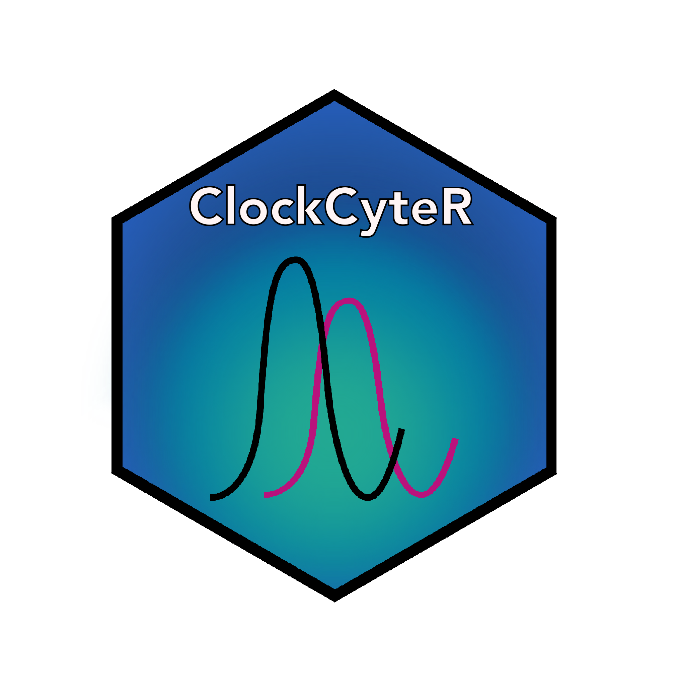
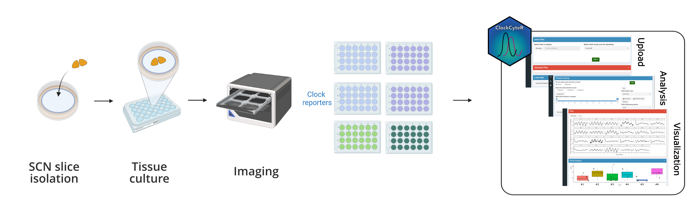
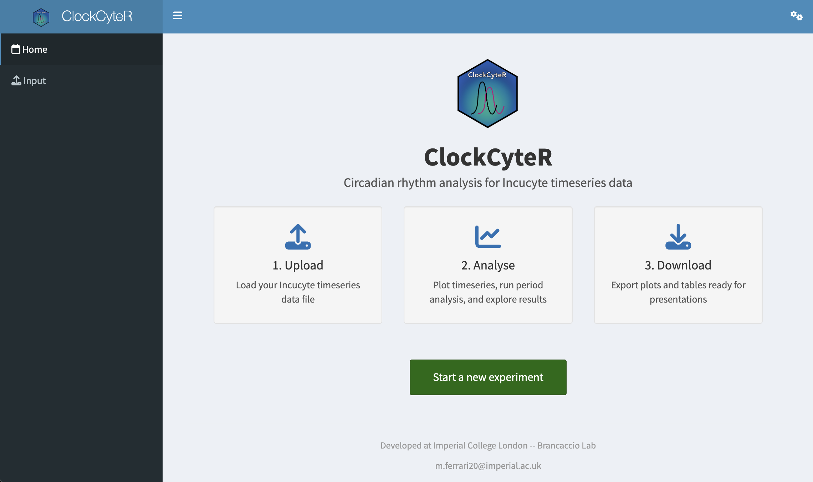
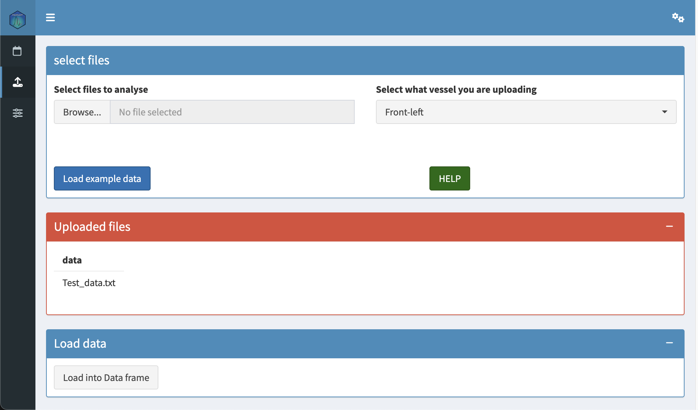
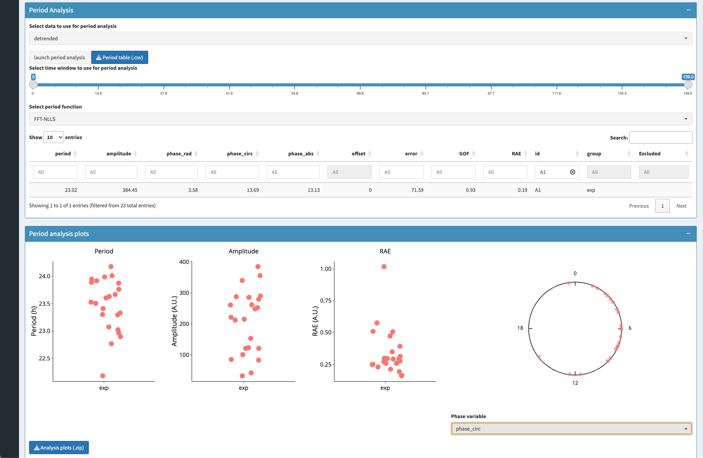

<!-- README.md is generated from README.Rmd. Please edit that file -->

```{r, include = FALSE}
knitr::opts_chunk$set(
  collapse = TRUE,
  comment = "#>",
  fig.path = "man/figures/README-",
  out.width = "100%"
)
```

# ClockCyteR <a href="https://github.com/cabaJr/clockcyteR"></a>

<!-- badges: start -->
[](https://lifecycle.r-lib.org/articles/stages.html#experimental)
[](https://github.com/cabaJr/clockcyteR/actions/workflows/R-CMD-check.yaml)
[](https://github.com/cabaJr/clockcyteR/commits/main)
<!-- badges: end -->

<br>

## Overview

ClockCyteR is a Shiny application for rapid phenotyping of circadian rhythm time-series data obtained from the [Incucyte](https://www.sartorius.com/en/products/cell-imaging-systems/live-cell-imaging) live-cell imaging platform. Starting from fluorescence intensity traces exported directly from the Incucyte software, ClockCyteR estimates key circadian parameters — period length, amplitude and relative phase — using multiple methods including FFT-NLLS and periodogram-based approaches (chi-squared, Lomb-Scargle, autocorrelation, Fourier and CWT). All results and plots can be exported for downstream analysis.

The app was developed and tested for experiments in which oscillating reporter cell lines (e.g. Bmal1-luciferase) are imaged continuously over several circadian cycles.

<!-- SCREENSHOT: add a composite screenshot showing the full workflow here -->
<!-- Example:  -->

<br>

## Installation

You can install the development version of ClockCyteR from GitHub:

``` r
# install.packages("remotes")
remotes::install_github("cabaJr/clockcyteR")
```

### Non-CRAN dependencies

ClockCyteR relies on the [rethomics](https://rethomics.github.io/) suite for circadian analysis. Install these before the package if they are not already present:

``` r
remotes::install_github("rethomics/behavr")
remotes::install_github("rethomics/ggetho")
remotes::install_github("rethomics/zeitgebr")
```

<br>

## Usage

Launch the app with:

``` r
library(clockcyteR)
clockcyteR::run_app()
```

This opens the ClockCyteR landing page in your browser.

<br>

### Workflow

**1. Upload data**

Click **"Start a new experiment"** on the landing page, then select your Incucyte `.txt` export file and the vessel position it corresponds to (front-left, centre-right, etc.). Multiple files from different vessel positions can be loaded in sequence.

<!-- SCREENSHOT: Input tab showing a file loaded and the metadata table -->
<!--  -->

Press **"Load into Data frame"** to parse the metadata and intensity traces.

<br>

**2. Explore and process timeseries**

Switch to the **Analysis** tab to visualise the raw traces. Use the time-window slider to zoom in on a region of interest, then optionally:

- **Remove outliers** — LOESS-based detection of aberrant data points
- **Detrend** — linear or cubic polynomial baseline removal
- **Normalize** — min/max scaling to \[0, 1\]

<!-- SCREENSHOT: Analysis tab with timeseries plotted -->
<!--  -->

<br>

**3. Estimate circadian parameters**

Select a period-estimation method (FFT-NLLS recommended for most datasets), set the time window for analysis, and press **"Launch period analysis"**. The app computes period length for each sample and displays a summary table alongside a jitter/bar plot of period estimates across groups.

<!-- SCREENSHOT: Period results table + barplot -->
<!--  -->

<br>

**4. Export results**

- Download annotated timeseries plots as a `.zip` archive
- Download the period / amplitude summary table as `.csv`
- Download raw cleaned or detrended data as `.csv`

<br>

## Citation

If you use ClockCyteR in your research, please cite:

> Ferrari et al. (2026, in press). *A high-throughput live imaging platform to investigate circuit-dependent regulation of circadian rhythms in brain tissue.* GitHub: https://github.com/cabaJr/clockcyteR

<br>

## Code of Conduct

Please note that the ClockCyteR project is released with a
[Contributor Code of Conduct](https://contributor-covenant.org/version/2/1/CODE_OF_CONDUCT.html).
By contributing to this project, you agree to abide by its terms.
